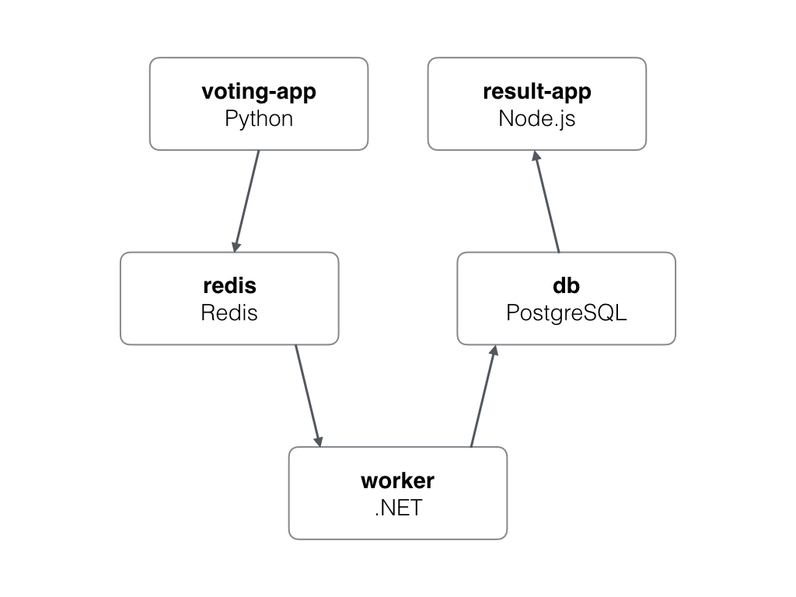

# Assignment: Create A Multi-Service Multi-Node Web App

## Goal: create networks, volumes, and services for a web-based "cats vs. dogs" voting app

Here is a basic diagram of how the 5 services will work:

- All images are on Docker Hub
- a `backend` and `frontend` overlay network are needed.
- The database server should use a named volume for preserving data.
Use the new `--mount` format to do this: `--mount type=volume,source=db-data,target=/var/lib/postgresql/data`

### Services (names below should be service names)

- vote
  - bretfisher/examplevotingapp_vote
  - web frontend for users to vote dog/cat
  - ideally published on TCP 80. Container listens on 80
  - on frontend network
  - 2+ replicas of this container

docker service create --name vote -p 80:80 --network frontend --replicas=2 bretfisher/examplevotingapp_vote

- redis
  - redis:3.2
  - key-value storage for incoming votes
  - no public ports
  - on frontend network
  - 1 replica NOTE VIDEO SAYS TWO BUT ONLY ONE NEEDED

docker service create --name redis --network frontend  redis:3.2

- worker
  - bretfisher/examplevotingapp_worker
  - backend processor of redis and storing results in postgres
  - no public ports
  - on frontend and backend networks
  - 1 replica

docker service create --name worker --network frontend --network backend bretfisher/examplevotingapp_worker

- db
  - postgres:9.4
  - one named volume needed, pointing to /var/lib/postgresql/data
  - on backend network
  - 1 replica
  - remember set env for password-less connections -e POSTGRES_HOST_AUTH_METHOD=trust

docker service create --name db --network backend --mount type=volume,source=db-data,destination=/var/lib/postgresql/data -e POSTGRES_HOST_AUTH_METHOD=trust postgres:9.4

- result
  - bretfisher/examplevotingapp_result
  - web app that shows results
  - runs on high port since just for admins (lets imagine)
  - so run on a high port of your choosing (I choose 5001), container listens on 80
  - on backend network
  - 1 replica

docker service create --name result --network backend -p 5001:80 bretfisher/examplevotingapp_result